<!--

-->

 

# Universal audio synthesizer control with normalizing flows

**This website is still under construction. We keep adding new results, so please come back later if you want more.**

This website presents additional material and experiments around the paper *Universal audio synthesizer control with normalizing flows*.

The ubiquity of sound synthesizers has reshaped music production and even entirely defined new music genres. However, the increasing complexity and number of parameters in modern synthesizers make them harder to master. We thus need methods to easily create and explore with synthesizers.

Our paper introduces a radically novel formulation of audio synthesizer control. We formalize it as finding an organized latent audio space that represents the capabilities of a synthesizer, while constructing an invertible mapping to the space of its parameters. By using this formulation, we show we can address simultaneously *automatic parameter inference*, *macro-control learning* and *audio-based preset exploration* within a single model. To solve this new formulation, we rely on Variational Auto-Encoders (VAE) and Normalizing Flows (NF) to organize and map the respective *auditory* and *parameter* spaces. We introduce a new type of NF named *regression flows* that allows to perform an invertible mapping between separate latent spaces, while steering the organization of some of the latent dimensions.

**Examples contents**
  * [Audio reconstruction](#audio-reconstruction)
  * [Macro-control learning](#macro-control-learning)
  * [Audio space interpolation](#audio-space-interpolation)
  * [Vocal sketching](#vocal-sketching)

**Code and implementation**
  * [Real-time implementation using Ableton Live](#real-time-implementation-using-ableton-live)
  * [Code](#code)

**Additional details**
  * [Mathematical appendix](#mathematical-appendix)
  * [Models architecture](#models-details)

## Audio reconstruction

Our first experiment consists in evaluating the reconstruction ability of our model. Reconstruction is done *via* parameter inference, which means an audio sample is embedded in the latent space, then mapped to synth parameters, that are used to synthesize the reconstructed audio. In the examples below, the first sound is a sample drawn from the test set, and the following are its reconstructions by the implemented models.

    <table>
        <tr>
            <th>Model</th>
            <th>Sample</th>
            <th>Spectrogram</th>
            <th>Parameters</th>
        </tr>
        <tr>
            <td><b>Original preset</b></td>
            <td>
                <audio controls> 
                    <source src="audio/reconstruction/batch1_example0/original.mp3">
                </audio>
            </td>
        </tr>
        <tr>
            <td>VAE-Flow-post</td>
            <td>
                <audio controls> 
                    <source src="audio/reconstruction/batch1_example0/vae_flow_mel_mse_cnn_flow_kl_f_iaf_1.mp3">
                </audio>
            </td>
        </tr>
        <tr>
            <td>VAE-Flow</td>
            <td>
                <audio controls> 
                    <source src="audio/reconstruction/batch1_example0/vae_flow_mel_mse_cnn_mlp_iaf_1.mp3">
                </audio>
            </td>
        </tr>
        <tr>
            <td>CNN</td>
            <td>
                <audio controls> 
                    <source src="audio/reconstruction/batch1_example0/cnn_mel_mse_1.mp3">
                </audio>
            </td>
        </tr>
        <tr>
            <td>MLP</td>
            <td>
                <audio controls> 
                    <source src="audio/reconstruction/batch1_example0/mlp_mel_mse_1.mp3">
                </audio>
            </td>
        </tr>
        <tr>
            <td>VAE</td>
            <td>
                <audio controls> 
                    <source src="audio/reconstruction/batch1_example0/vae_mel_mse_cnn_mlp_1.mp3">
                </audio>
            </td>
        </tr>
        <tr>
            <td>WAE</td>
            <td>
                <audio controls> 
                    <source src="audio/reconstruction/batch1_example0/wae_mel_mse_cnn_mlp_1.mp3">
                </audio>
            </td>
        </tr>
    </table>

 

## Macro-control learning

The latent dimensions can be seen as meta-parameters for the synthesizer that naturally arise from our framework. Moreover, as they act in the latent audio space, one could hope they impact audio features in a smoother way than native parameters.

The following examples present the evolution of synth parameters and corresponding spectrogram while moving along a dimension of the latent space. Spectrograms generally show a smooth variation in audio features, while parameters move in a non-independent and less smooth fashion. This proves latent dimensions rather encode audio features than simply parameters values.

    
Metaparameter \(z_{5}\)

    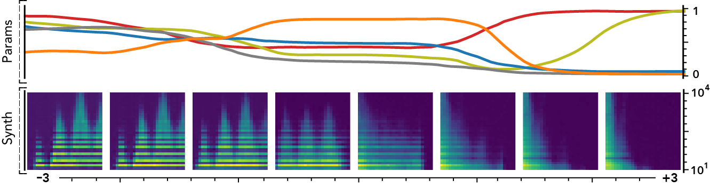

    

        <audio controls style="width: 10.5%; padding: 0.5%">
            <source src="audio/meta_parameters/z5/dim_0.mp3">
        </audio><!--
        --><audio controls style="width: 10.5%; padding: 0.5%">
            <source src="audio/meta_parameters/z5/dim_1.mp3">
        </audio><!--
        --><audio controls style="width: 10.5%; padding: 0.5%">
            <source src="audio/meta_parameters/z5/dim_2.mp3">
        </audio><!--
        --><audio controls style="width: 10.5%; padding: 0.5%">
            <source src="audio/meta_parameters/z5/dim_3.mp3">
        </audio><!--
        --><audio controls style="width: 10.5%; padding: 0.5%">
            <source src="audio/meta_parameters/z5/dim_4.mp3">
        </audio><!--
        --><audio controls style="width: 10.5%; padding: 0.5%">
            <source src="audio/meta_parameters/z5/dim_5.mp3">
        </audio><!--
        --><audio controls style="width: 10.5%; padding: 0.5%">
            <source src="audio/meta_parameters/z5/dim_6.mp3">
        </audio><!--
        --><audio controls style="width: 10.5%; padding: 0.5%">
            <source src="audio/meta_parameters/z5/dim_7.mp3">
        </audio>
    

     

    
Metaparameter \(z_{11}\)

    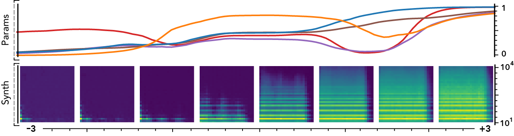

    

        <audio controls style="width: 10.5%; padding: 0.5%">
            <source src="audio/meta_parameters/z11/dim_0.mp3">
        </audio><!--
        --><audio controls style="width: 10.5%; padding: 0.5%">
            <source src="audio/meta_parameters/z11/dim_1.mp3">
        </audio><!--
        --><audio controls style="width: 10.5%; padding: 0.5%">
            <source src="audio/meta_parameters/z11/dim_2.mp3">
        </audio><!--
        --><audio controls style="width: 10.5%; padding: 0.5%">
            <source src="audio/meta_parameters/z11/dim_3.mp3">
        </audio><!--
        --><audio controls style="width: 10.5%; padding: 0.5%">
            <source src="audio/meta_parameters/z11/dim_4.mp3">
        </audio><!--
        --><audio controls style="width: 10.5%; padding: 0.5%">
            <source src="audio/meta_parameters/z11/dim_5.mp3">
        </audio><!--
        --><audio controls style="width: 10.5%; padding: 0.5%">
            <source src="audio/meta_parameters/z11/dim_6.mp3">
        </audio><!--
        --><audio controls style="width: 10.5%; padding: 0.5%">
            <source src="audio/meta_parameters/z11/dim_7.mp3">
        </audio>
    

    
     
    
<b>Click <a href="javascript:look('divMetaParams');" title="More comparisons">here</a> to see more examples</b>

    
    

        
    
Metaparameter \(z_{6}\)

    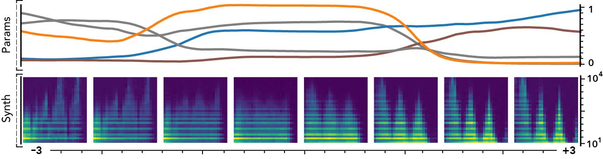

    

        <audio controls style="width: 10.5%; padding: 0.5%">
            <source src="audio/meta_parameters/z6/dim_0.mp3">
        </audio><!--
        --><audio controls style="width: 10.5%; padding: 0.5%">
            <source src="audio/meta_parameters/z6/dim_1.mp3">
        </audio><!--
        --><audio controls style="width: 10.5%; padding: 0.5%">
            <source src="audio/meta_parameters/z6/dim_2.mp3">
        </audio><!--
        --><audio controls style="width: 10.5%; padding: 0.5%">
            <source src="audio/meta_parameters/z6/dim_3.mp3">
        </audio><!--
        --><audio controls style="width: 10.5%; padding: 0.5%">
            <source src="audio/meta_parameters/z6/dim_4.mp3">
        </audio><!--
        --><audio controls style="width: 10.5%; padding: 0.5%">
            <source src="audio/meta_parameters/z6/dim_5.mp3">
        </audio><!--
        --><audio controls style="width: 10.5%; padding: 0.5%">
            <source src="audio/meta_parameters/z6/dim_6.mp3">
        </audio><!--
        --><audio controls style="width: 10.5%; padding: 0.5%">
            <source src="audio/meta_parameters/z6/dim_7.mp3">
        </audio>
    

     
        
    
Metaparameter \(z_{8}\)

    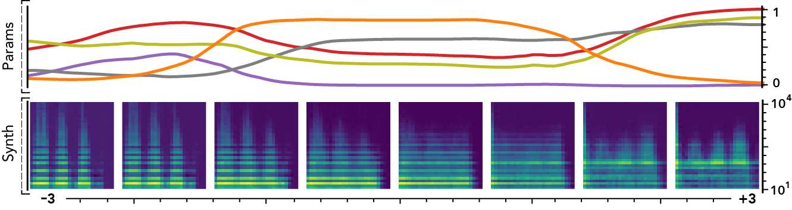

    

        <audio controls style="width: 10.5%; padding: 0.5%">
            <source src="audio/meta_parameters/z8/dim_0.mp3">
        </audio><!--
        --><audio controls style="width: 10.5%; padding: 0.5%">
            <source src="audio/meta_parameters/z8/dim_1.mp3">
        </audio><!--
        --><audio controls style="width: 10.5%; padding: 0.5%">
            <source src="audio/meta_parameters/z8/dim_2.mp3">
        </audio><!--
        --><audio controls style="width: 10.5%; padding: 0.5%">
            <source src="audio/meta_parameters/z8/dim_3.mp3">
        </audio><!--
        --><audio controls style="width: 10.5%; padding: 0.5%">
            <source src="audio/meta_parameters/z8/dim_4.mp3">
        </audio><!--
        --><audio controls style="width: 10.5%; padding: 0.5%">
            <source src="audio/meta_parameters/z8/dim_5.mp3">
        </audio><!--
        --><audio controls style="width: 10.5%; padding: 0.5%">
            <source src="audio/meta_parameters/z8/dim_6.mp3">
        </audio><!--
        --><audio controls style="width: 10.5%; padding: 0.5%">
            <source src="audio/meta_parameters/z8/dim_7.mp3">
        </audio>
    

     

    
Metaparameter \(z_{9}\)

    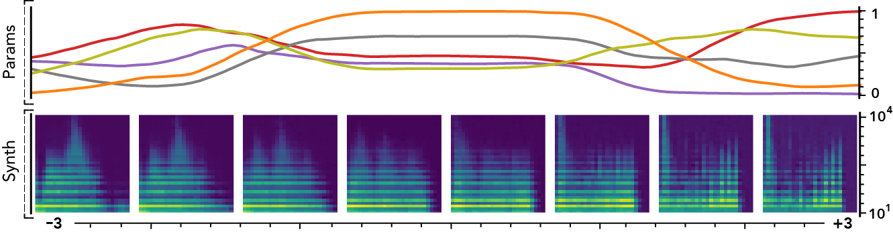

    

        <audio controls style="width: 10.5%; padding: 0.5%">
            <source src="audio/meta_parameters/z9/dim_0.mp3">
        </audio><!--
        --><audio controls style="width: 10.5%; padding: 0.5%">
            <source src="audio/meta_parameters/z9/dim_1.mp3">
        </audio><!--
        --><audio controls style="width: 10.5%; padding: 0.5%">
            <source src="audio/meta_parameters/z9/dim_2.mp3">
        </audio><!--
        --><audio controls style="width: 10.5%; padding: 0.5%">
            <source src="audio/meta_parameters/z9/dim_3.mp3">
        </audio><!--
        --><audio controls style="width: 10.5%; padding: 0.5%">
            <source src="audio/meta_parameters/z9/dim_4.mp3">
        </audio><!--
        --><audio controls style="width: 10.5%; padding: 0.5%">
            <source src="audio/meta_parameters/z9/dim_5.mp3">
        </audio><!--
        --><audio controls style="width: 10.5%; padding: 0.5%">
            <source src="audio/meta_parameters/z9/dim_6.mp3">
        </audio><!--
        --><audio controls style="width: 10.5%; padding: 0.5%">
            <source src="audio/meta_parameters/z9/dim_7.mp3">
        </audio>
    

     
        
    
Metaparameter \(z_{15}\)

    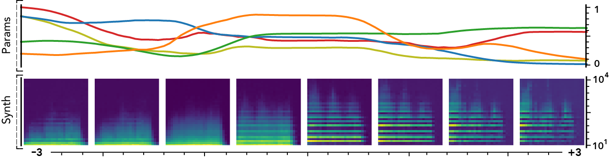

    

        <audio controls style="width: 10.5%; padding: 0.5%">
            <source src="audio/meta_parameters/z15/dim_0.mp3">
        </audio><!--
        --><audio controls style="width: 10.5%; padding: 0.5%">
            <source src="audio/meta_parameters/z15/dim_1.mp3">
        </audio><!--
        --><audio controls style="width: 10.5%; padding: 0.5%">
            <source src="audio/meta_parameters/z15/dim_2.mp3">
        </audio><!--
        --><audio controls style="width: 10.5%; padding: 0.5%">
            <source src="audio/meta_parameters/z15/dim_3.mp3">
        </audio><!--
        --><audio controls style="width: 10.5%; padding: 0.5%">
            <source src="audio/meta_parameters/z15/dim_4.mp3">
        </audio><!--
        --><audio controls style="width: 10.5%; padding: 0.5%">
            <source src="audio/meta_parameters/z15/dim_5.mp3">
        </audio><!--
        --><audio controls style="width: 10.5%; padding: 0.5%">
            <source src="audio/meta_parameters/z15/dim_6.mp3">
        </audio><!--
        --><audio controls style="width: 10.5%; padding: 0.5%">
            <source src="audio/meta_parameters/z15/dim_7.mp3">
        </audio>
    

     
        
    
Metaparameter \(z_{16}\)

    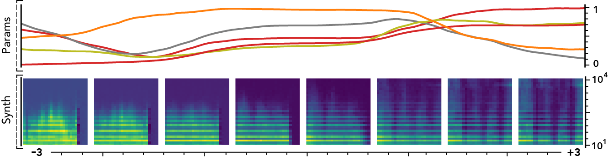

    

        <audio controls style="width: 10.5%; padding: 0.5%">
            <source src="audio/meta_parameters/z16/dim_0.mp3">
        </audio><!--
        --><audio controls style="width: 10.5%; padding: 0.5%">
            <source src="audio/meta_parameters/z16/dim_1.mp3">
        </audio><!--
        --><audio controls style="width: 10.5%; padding: 0.5%">
            <source src="audio/meta_parameters/z16/dim_2.mp3">
        </audio><!--
        --><audio controls style="width: 10.5%; padding: 0.5%">
            <source src="audio/meta_parameters/z16/dim_3.mp3">
        </audio><!--
        --><audio controls style="width: 10.5%; padding: 0.5%">
            <source src="audio/meta_parameters/z16/dim_4.mp3">
        </audio><!--
        --><audio controls style="width: 10.5%; padding: 0.5%">
            <source src="audio/meta_parameters/z16/dim_5.mp3">
        </audio><!--
        --><audio controls style="width: 10.5%; padding: 0.5%">
            <source src="audio/meta_parameters/z16/dim_6.mp3">
        </audio><!--
        --><audio controls style="width: 10.5%; padding: 0.5%">
            <source src="audio/meta_parameters/z16/dim_7.mp3">
        </audio>
    

     
        
    
Metaparameter \(z_{19}\)

    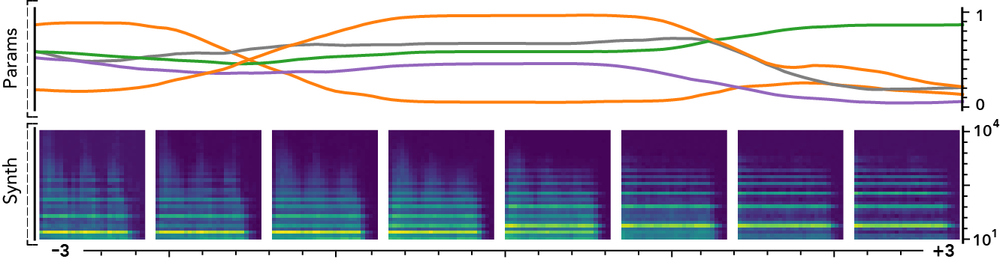

    

        <audio controls style="width: 10.5%; padding: 0.5%">
            <source src="audio/meta_parameters/z19/dim_0.mp3">
        </audio><!--
        --><audio controls style="width: 10.5%; padding: 0.5%">
            <source src="audio/meta_parameters/z19/dim_1.mp3">
        </audio><!--
        --><audio controls style="width: 10.5%; padding: 0.5%">
            <source src="audio/meta_parameters/z19/dim_2.mp3">
        </audio><!--
        --><audio controls style="width: 10.5%; padding: 0.5%">
            <source src="audio/meta_parameters/z19/dim_3.mp3">
        </audio><!--
        --><audio controls style="width: 10.5%; padding: 0.5%">
            <source src="audio/meta_parameters/z19/dim_4.mp3">
        </audio><!--
        --><audio controls style="width: 10.5%; padding: 0.5%">
            <source src="audio/meta_parameters/z19/dim_5.mp3">
        </audio><!--
        --><audio controls style="width: 10.5%; padding: 0.5%">
            <source src="audio/meta_parameters/z19/dim_6.mp3">
        </audio><!--
        --><audio controls style="width: 10.5%; padding: 0.5%">
            <source src="audio/meta_parameters/z19/dim_7.mp3">
        </audio>
    

     
        
    
Metaparameter \(z_{20}\)

    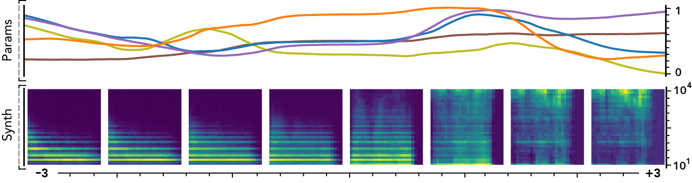

    

        <audio controls style="width: 10.5%; padding: 0.5%">
            <source src="audio/meta_parameters/z20/dim_0.mp3">
        </audio><!--
        --><audio controls style="width: 10.5%; padding: 0.5%">
            <source src="audio/meta_parameters/z20/dim_1.mp3">
        </audio><!--
        --><audio controls style="width: 10.5%; padding: 0.5%">
            <source src="audio/meta_parameters/z20/dim_2.mp3">
        </audio><!--
        --><audio controls style="width: 10.5%; padding: 0.5%">
            <source src="audio/meta_parameters/z20/dim_3.mp3">
        </audio><!--
        --><audio controls style="width: 10.5%; padding: 0.5%">
            <source src="audio/meta_parameters/z20/dim_4.mp3">
        </audio><!--
        --><audio controls style="width: 10.5%; padding: 0.5%">
            <source src="audio/meta_parameters/z20/dim_5.mp3">
        </audio><!--
        --><audio controls style="width: 10.5%; padding: 0.5%">
            <source src="audio/meta_parameters/z20/dim_6.mp3">
        </audio><!--
        --><audio controls style="width: 10.5%; padding: 0.5%">
            <source src="audio/meta_parameters/z20/dim_7.mp3">
        </audio>
    

     
        
    
Metaparameter \(z_{24}\)

    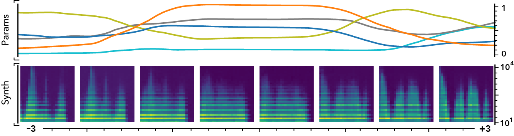

    

        <audio controls style="width: 10.5%; padding: 0.5%">
            <source src="audio/meta_parameters/z24/dim_0.mp3">
        </audio><!--
        --><audio controls style="width: 10.5%; padding: 0.5%">
            <source src="audio/meta_parameters/z24/dim_1.mp3">
        </audio><!--
        --><audio controls style="width: 10.5%; padding: 0.5%">
            <source src="audio/meta_parameters/z24/dim_2.mp3">
        </audio><!--
        --><audio controls style="width: 10.5%; padding: 0.5%">
            <source src="audio/meta_parameters/z24/dim_3.mp3">
        </audio><!--
        --><audio controls style="width: 10.5%; padding: 0.5%">
            <source src="audio/meta_parameters/z24/dim_4.mp3">
        </audio><!--
        --><audio controls style="width: 10.5%; padding: 0.5%">
            <source src="audio/meta_parameters/z24/dim_5.mp3">
        </audio><!--
        --><audio controls style="width: 10.5%; padding: 0.5%">
            <source src="audio/meta_parameters/z24/dim_6.mp3">
        </audio><!--
        --><audio controls style="width: 10.5%; padding: 0.5%">
            <source src="audio/meta_parameters/z24/dim_7.mp3">
        </audio>
    

     
        
    
Metaparameter \(z_{25}\)

    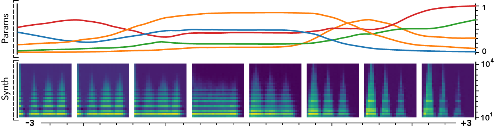

    

        <audio controls style="width: 10.5%; padding: 0.5%">
            <source src="audio/meta_parameters/z25/dim_0.mp3">
        </audio><!--
        --><audio controls style="width: 10.5%; padding: 0.5%">
            <source src="audio/meta_parameters/z25/dim_1.mp3">
        </audio><!--
        --><audio controls style="width: 10.5%; padding: 0.5%">
            <source src="audio/meta_parameters/z25/dim_2.mp3">
        </audio><!--
        --><audio controls style="width: 10.5%; padding: 0.5%">
            <source src="audio/meta_parameters/z25/dim_3.mp3">
        </audio><!--
        --><audio controls style="width: 10.5%; padding: 0.5%">
            <source src="audio/meta_parameters/z25/dim_4.mp3">
        </audio><!--
        --><audio controls style="width: 10.5%; padding: 0.5%">
            <source src="audio/meta_parameters/z25/dim_5.mp3">
        </audio><!--
        --><audio controls style="width: 10.5%; padding: 0.5%">
            <source src="audio/meta_parameters/z25/dim_6.mp3">
        </audio><!--
        --><audio controls style="width: 10.5%; padding: 0.5%">
            <source src="audio/meta_parameters/z25/dim_7.mp3">
        </audio>
    

     
        
    
Metaparameter \(z_{26}\)

    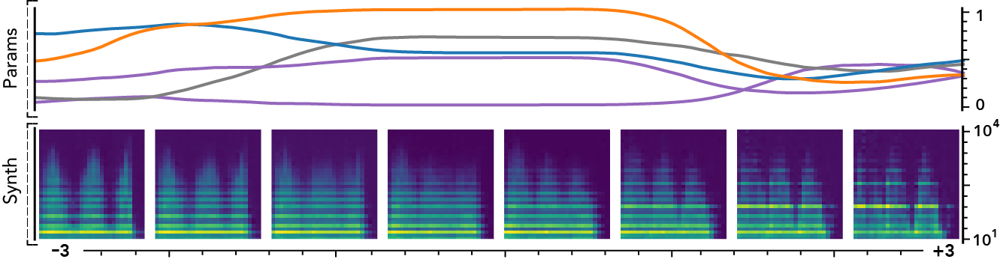

    

        <audio controls style="width: 10.5%; padding: 0.5%">
            <source src="audio/meta_parameters/z26/dim_0.mp3">
        </audio><!--
        --><audio controls style="width: 10.5%; padding: 0.5%">
            <source src="audio/meta_parameters/z26/dim_1.mp3">
        </audio><!--
        --><audio controls style="width: 10.5%; padding: 0.5%">
            <source src="audio/meta_parameters/z26/dim_2.mp3">
        </audio><!--
        --><audio controls style="width: 10.5%; padding: 0.5%">
            <source src="audio/meta_parameters/z26/dim_3.mp3">
        </audio><!--
        --><audio controls style="width: 10.5%; padding: 0.5%">
            <source src="audio/meta_parameters/z26/dim_4.mp3">
        </audio><!--
        --><audio controls style="width: 10.5%; padding: 0.5%">
            <source src="audio/meta_parameters/z26/dim_5.mp3">
        </audio><!--
        --><audio controls style="width: 10.5%; padding: 0.5%">
            <source src="audio/meta_parameters/z26/dim_6.mp3">
        </audio><!--
        --><audio controls style="width: 10.5%; padding: 0.5%">
            <source src="audio/meta_parameters/z26/dim_7.mp3">
        </audio>
    

     
        
    
Metaparameter \(z_{28}\)

    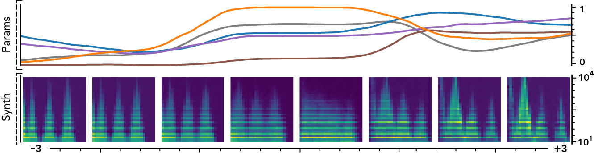

    

        <audio controls style="width: 10.5%; padding: 0.5%">
            <source src="audio/meta_parameters/z28/dim_0.mp3">
        </audio><!--
        --><audio controls style="width: 10.5%; padding: 0.5%">
            <source src="audio/meta_parameters/z28/dim_1.mp3">
        </audio><!--
        --><audio controls style="width: 10.5%; padding: 0.5%">
            <source src="audio/meta_parameters/z28/dim_2.mp3">
        </audio><!--
        --><audio controls style="width: 10.5%; padding: 0.5%">
            <source src="audio/meta_parameters/z28/dim_3.mp3">
        </audio><!--
        --><audio controls style="width: 10.5%; padding: 0.5%">
            <source src="audio/meta_parameters/z28/dim_4.mp3">
        </audio><!--
        --><audio controls style="width: 10.5%; padding: 0.5%">
            <source src="audio/meta_parameters/z28/dim_5.mp3">
        </audio><!--
        --><audio controls style="width: 10.5%; padding: 0.5%">
            <source src="audio/meta_parameters/z28/dim_6.mp3">
        </audio><!--
        --><audio controls style="width: 10.5%; padding: 0.5%">
            <source src="audio/meta_parameters/z28/dim_7.mp3">
        </audio>
    

     
        
    

    

 

## Audio space interpolation

In this experiment, we select two audio samples, and embed them in the latent space as $$\mathbf{z}_0$$ and $$\mathbf{z}_1$$. We then explore their neighborhoods, and continuously interpolate in between. At each latent point in the neighborhoods and interpolation, we are able to output the corresponding synthesizer parameters and thus to synthesize audio.

On the figure below, one can listen to the output and visualize the way spectograms and parameters evolve. It is encouraging to see how the spectrograms look alike in the neighborhoods of $$\mathbf{z}_0$$ and $$\mathbf{z}_1$$, even though parameters may vary more.

    <table class="noRowLine neighborhood audioTable">
        <tr>
            <th rowspan="2">Audio</th>
            <th colspan="2">\(\mathbf{z}_0 + \mathcal{N}(0, 0.1)\)</th>
            <th rowspan="2">Audio space</th>
            <th colspan="2">\(\mathbf{z}_1 + \mathcal{N}(0, 0.1)\)</th>
            <th rowspan="2">Audio</th>
        </tr>
        <tr>
            <th>Parameters</th>
            <th>Spectrogram</th>
            <th>Spectrogram</th>
            <th>Parameters</th>
        </tr>
        <tr>
            <td><audio controls><source src=""></audio></td>
            <td>PARAMS IMG</td>
            <td>SPECTROGRAM</td>
            <td rowspan="5">AUDIO SPACE IMG</td>
            <td>SPECTROGRAM</td>
            <td>PARAMS IMG</td>
            <td><audio controls><source src=""></audio></td>
        </tr>
        <tr>
            <td><audio controls><source src=""></audio></td>
            <td>PARAMS IMG</td>
            <td>SPECTROGRAM</td>
            <td>SPECTROGRAM</td>
            <td>PARAMS IMG</td>
            <td><audio controls><source src=""></audio></td>
        </tr>
        <tr>
            <td><audio controls><source src=""></audio></td>
            <td>PARAMS IMG</td>
            <td>SPECTROGRAM</td>
            <td>SPECTROGRAM</td>
            <td>PARAMS IMG</td>
            <td><audio controls><source src=""></audio></td>
        </tr>
        <tr>
            <td><audio controls><source src=""></audio></td>
            <td>PARAMS IMG</td>
            <td>SPECTROGRAM</td>
            <td>SPECTROGRAM</td>
            <td>PARAMS IMG</td>
            <td><audio controls><source src=""></audio></td>
        </tr>
        <tr>
            <td><audio controls><source src=""></audio></td>
            <td>PARAMS IMG</td>
            <td>SPECTROGRAM</td>
            <td>SPECTROGRAM</td>
            <td>PARAMS IMG</td>
            <td><audio controls><source src=""></audio></td>
        </tr>
    </table>

    <table class="noRowLine neighborhood interpolation">
        <tr>
            <td colspan="6">INTERPOLATION IMG</td>
        </tr>
        <tr>
            <td><audio controls><source src=""></audio></td>
            <td><audio controls><source src=""></audio></td>
            <td><audio controls><source src=""></audio></td>
            <td><audio controls><source src=""></audio></td>
            <td><audio controls><source src=""></audio></td>
            <td><audio controls><source src=""></audio></td>
        </tr>
    </table>

## Vocal sketching

Finally, our models allow vocal sketching, by embedding a recorded vocal sample in the latent space and finding the matching parameters. Below are examples of how the models respond to several recorded samples.

## Real-time implementation using Ableton Live

Not available yet.

## Code

The full code will only be released after the end of the review process and will be available on the corresponding [GitHub repository](https://github.com/acids-ircam/flow_synthesizer).

## Models details

\emph{Baseline models.} In order to evaluate our proposal, we implemented several feed-forward deep models that take the spectrograms $\bx_i$ as input and try to infer the corresponding parameters $\bv_i$. First, we implement a 5-layers $MLP$ with 2048 hidden units per layer, Exponential Linear Unit (ELU) activation, batch normalization and dropout with $p=.3$. This model is applied on a flattened version of the input and the final layer is a sigmoid activation. We implement a convolutional model composed of 5 layers with 128 channels of strided dilated 2-D convolutions with kernel size 7, stride 2 and an exponential dilation factor of $2^{l}$ (starting at $l=0$) with batch normalization and ELU activation. The convolutions are followed by a 3-layers MLP identical to the previous model. Finally, we implemented a \textit{Residual Network}, with parameters settings identical to $CNN$ and denote this model $ResCNN$. All these models are trained with a MSE loss on the parameters vector.\footnote{All remaining details on the models along with the complete source code for full reproducibility are available on the supporting webpage}

\emph{Our models.} We implemented various *AE architectures by relying on the $CNN$ setup for encoders and decoders. However, we halve their number of parameters (by dividing the number of units and channels) to perform a fair comparison by obtaining roughly the same capacity as the baselines. First, we implement a simple deterministic $AE$ without regularization. We implement the $VAE$ by adding a KL regularization to the latent space and the $WAE$ by replacing the KL by the MMD. Finally, we implement $VAE_{flow}$ by adding a normalizing flow of 16 successive IAF transforms to the $VAE$ posterior. All AEs map to latent spaces of dimensionality equal to the number of synthesis parameters. We perform \emph{warmup} \cite{sonderby2016train} by linearly increasing the latent regularization $\beta$ from 0 to 1 for 100 epochs. First, we train all models with a 2-layers MLP to predict the parameters based on the latent space. Then, we evaluate \textit{regression flows} ($Flow_{reg}$) by adding them to $VAE_{flow}$, with an IAF of length 16 without using semantic tags. Finally, we add the \textit{disentangling flows} ($Flow_{dis}$) by introducing our objective defined in Section~\ref{sec:disentangling} %We underline the fact that we performed no hyper-parameter tuning whatsoever. Hence, our results might easily be improved.

\emph{Optimization.} We train all models for 500 epochs with ADAM, initial rate 2e-4, Xavier initialization and a scheduler that halves the rate if validation loss stalls for 20 epochs. With this setup, the most complex model only takes $\sim$5 hours to train on a NVIDIA Titan Xp GPU.

